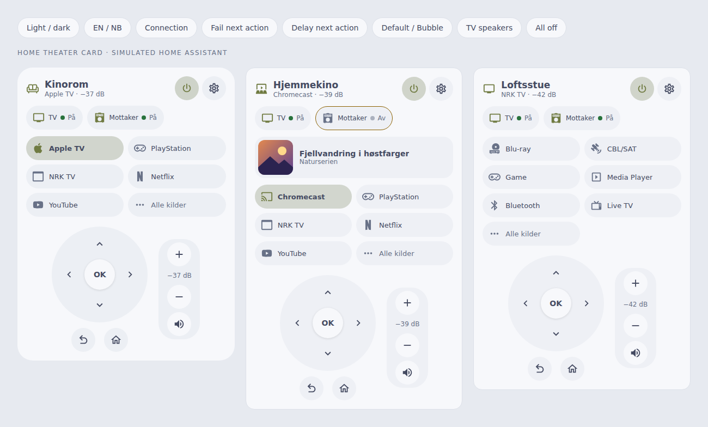
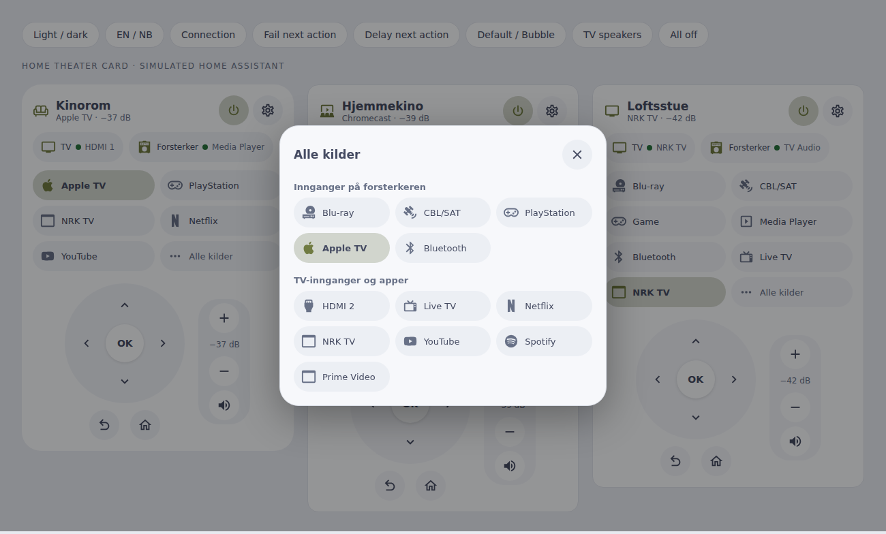
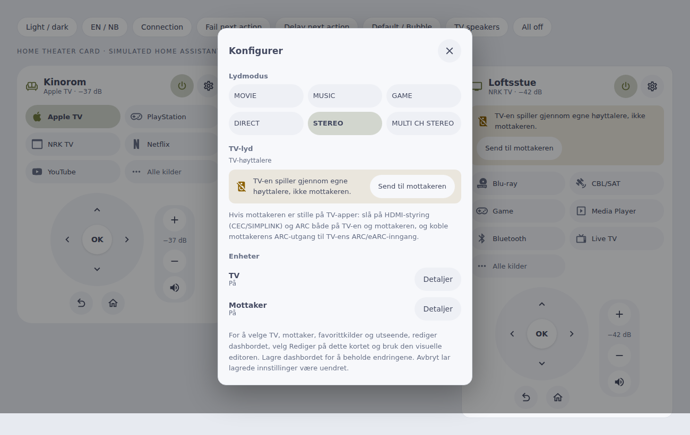

# Home Theater Card

A Home Assistant dashboard card for a TV and AV receiver: one power button, source selection, arrows and volume.

Use one card per room instead of a full remote replica. It shows only what a household needs every day: turn the room on or off, pick what to watch, move around menus and set the volume. It works with the LG webOS TV and Denon AVR (Denon/Marantz) integrations that ship with Home Assistant, with no companion integration. Default and Bubble appearances follow your dashboard, with the same color schemes as the other household cards.

## With the Home Theater integration

The card works on its own with a TV and a receiver. With the [Home Theater integration](https://github.com/mvheimburg/home-theater) (0.2.0 or later), each card shows one room: a new card is bound to a room straight away (choose another under **Home Theater room** in the editor) and takes the room's name as its title. The card then:

- shows **what is actually playing**, with the title, series and artwork of the player on the active input (for example a Chromecast or Music Assistant player);
- keeps the **sources while the room is off**. Home Assistant hides a player's source list while it is off, so a card bound directly to the devices has only its configured favourites then;
- sends **arrow keys to the active player's remote** (Android TV Remote, Apple TV) when one is linked, and to the TV otherwise;
- leaves power and source sequencing, retries and **Wake-on-LAN** to the integration, so they work the same from automations and voice.

Devices, how they connect, favourite sources, display names and linked players then live under **Settings → Devices & services → Home Theater → Configure**; the card's Configure dialog links there. Title, icon, appearance and color scheme stay in the card editor.

```yaml
type: custom:home-theater-card
title: Stue
theater: media_player.stue_theater
```



## What it does

- **Power** in the header turns the TV and receiver on or off together.
- **Sources** are chips for your favourites, with every other receiver input and TV app one tap away under **All sources**. Picking a source switches both devices:
  - a *receiver input* (Apple TV, game console, Blu-ray…) selects that input on the receiver and puts the TV on the HDMI input the receiver is connected to;
  - a *TV input or app* (Netflix, NRK TV, Live TV…) starts it on the TV and switches the receiver to its TV audio input, so the sound comes back over ARC.
  If the room is off, the card turns it on first and waits for the TV before starting an app.
- **Arrows, OK, Back and Home** go to the TV while it is on. The LG passes them on over HDMI-CEC (SIMPLINK) to many players on its current input.
- **Volume** steps and mute go to the receiver, shown in the receiver's own dB figures.
- **ARC check**: when a receiver is configured and the TV reports that it is playing through its own speakers, the card says so and offers **Send to receiver**.
- **Configure** (cog) holds the receiver's sound modes, the TV's current sound output with the ARC fix, device details, and a hint when Home Assistant cannot turn the TV on.

The card only calls the players' public services. The integrations and your devices stay authoritative. Actions wait for Home Assistant to confirm them, show failures, and are disabled while a device is unavailable.



## Install

Add `https://github.com/mvheimburg/lovelace-home-theater` to HACS as a **Dashboard** custom repository, then install **Home Theater Card**. The resource is `/hacsfiles/lovelace-home-theater/home-theater-card.js`, type **JavaScript module**. Refresh the browser after installation or upgrade.

For manual installation, copy `dist/home-theater-card.js` to `/config/www/home-theater-card.js` and register `/local/home-theater-card.js` as a JavaScript module under dashboard resources.

Requirements: the **LG webOS TV** integration for the TV and, optionally, a receiver `media_player` such as the **Denon AVR** integration. Tested against Home Assistant 2026.9.

## Set up without the integration

Without the integration, open **Without the Home Theater integration** in the card editor to bind the devices directly. There you can:

- choose the TV (LG webOS media players only) and the AV receiver;
- choose the **TV input the receiver is connected to** (for example `HDMI 1`) and the **receiver input for the TV's own sound** (usually `TV Audio`), both from the devices' own lists;
- add **favourite sources** in the order you want, with optional display names and icons. Leave the list empty to show the receiver's inputs and Live TV;
- set the title, icon, appearance and color scheme.

Save the dashboard to keep changes; Cancel leaves the saved dashboard untouched. The card creates no entities and changes no automations.

The IDs below are **examples**; replace them with your own entities.

```yaml
type: custom:home-theater-card
title: Stue
tv: media_player.example_tv
receiver: media_player.example_receiver
tv_input: HDMI 1
tv_audio: TV Audio
sources:
  - device: receiver
    source: Media Player
    name: Apple TV
    icon: mdi:apple
  - device: receiver
    source: Game
    name: PlayStation
  - device: tv
    source: NRK TV
  - device: tv
    source: Netflix
```

| Option | Default | Purpose |
| --- | --- | --- |
| `title` | room name, or TV | Room title. |
| `icon` | `mdi:television` | Header icon. |
| `theater` | — | A Home Theater integration room (`media_player`). When set, `tv`, `receiver`, `tv_input`, `tv_audio` and `sources` are ignored; the integration owns them. |
| `tv` | — | LG webOS `media_player`. Arrows need it. |
| `receiver` | — | AV receiver `media_player`. Volume goes here when set. |
| `tv_input` | none | TV input carrying the receiver's picture. Selected when you pick a receiver source; never shown as a source. |
| `tv_audio` | `TV Audio` | Receiver input that plays the TV's sound over ARC. Selected when you pick a TV source; never shown as a source. |
| `sources` | receiver inputs + Live TV | Favourites: `device` (`receiver` or `tv`), `source` (exact name from that player's source list), optional `name` and `icon`. |
| `appearance` | `default` | `default` or `bubble`; Bubble Card need not be installed. |
| `color_scheme` | `home-assistant` | `home-assistant`, `bright`, `warm`, `mint`, `sky` or `lavender`. |

Source names come from the devices and are shown as they are; give a source a `name` to relabel it (for example Denon's `Media Player` as `Apple TV`). Icons are guessed from the name when not set.

## Turning the TV on (Wake-on-LAN)

An LG TV is off the network when it is off, so Home Assistant can only turn it on by sending a Wake-on-LAN packet. Until you add that, the card turns on the receiver alone. The receiver's HDMI control often wakes the TV then, and the Configure dialog explains what is missing.

1. On the TV, enable **Turn on via Wi-Fi** / **Mobile TV On** (the name varies with webOS version, under *General → Devices* or *Connection*). A wired Ethernet connection is the most reliable.
2. Add `wake_on_lan:` to `configuration.yaml` and restart Home Assistant.
3. Add an automation per TV, using the TV's MAC address (shown in the TV's network settings or your router):

```yaml
alias: Turn on TV with Wake-on-LAN
triggers:
  - trigger: webostv.turn_on
    entity_id: media_player.example_tv
actions:
  - action: wake_on_lan.send_magic_packet
    data:
      mac: "AA:BB:CC:DD:EE:FF"
```

In the automation editor this is the TV device's **Device is requested to turn on** trigger. Once it exists, the TV offers *turn on* to Home Assistant, and the card's Power button and TV sources wake it directly.

## ARC checklist

When TV apps play but the receiver is silent, check the chain on both devices. The Denon AVR-X2200W and AVR-X3300W support ARC (not eARC).

- **Cable and port**: connect the receiver's **HDMI MONITOR (ARC)** output to the TV's HDMI input labelled **ARC** or **eARC**, with a High Speed HDMI cable.
- **Denon**: *Setup → Video → HDMI Setup*: **HDMI Control** On, **ARC** On, **TV Audio Switching** On. Turn the receiver off and on after changing HDMI Control.
- **LG**: *Settings → General → Devices → HDMI Settings*: **SIMPLINK (HDMI-CEC)** On. *Settings → Sound → Sound Out*: **HDMI (ARC) Device**. If the TV offers **eARC Support**, try it **Off** with these ARC-only receivers.
- The card's **TV sound** row (under Configure) shows what the TV reports. *Receiver (HDMI ARC)* is correct; *TV speakers* means the TV fell back and **Send to receiver** switches it back.

## Everyday details

- **Unavailable devices**: sources and controls for an unavailable device are disabled. When the Home Assistant connection drops, all actions are disabled and Configure stays available.
- **Pending and failures**: while a power or source change is in progress, the status reads *Updating…* and repeated taps are ignored. A rejected command or a missing confirmation within 30 seconds is shown in the card; controls always reflect Home Assistant's reported state.
- **History**: this card shows no sensor readings. Volume, source and power are controls, and their history adds nothing here, so values are not linked to a history view.
- **Languages**: the card and editor follow Home Assistant's language in English and Norwegian Bokmål (`nb`, `nb-NO`, `no`; `nn` falls back to Bokmål), and update when it changes. dB values follow your number format. Source, app and sound mode names from the devices stay as reported. Card-picker metadata is English because Home Assistant provides no language there.



## Development

```sh
npm ci
npm test          # browser tests (Chromium)
npm run lint
npm run typecheck
npm run build     # writes dist/home-theater-card.js; commit it
node scripts/screenshot.cjs   # regenerates docs/*.png from demo/ with dummy data
```

The release workflow tags and publishes `v<version>` from `package.json` when `main` changes.
